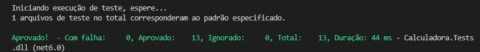

# Trilha .NET - Trabalhando com Desenvolvimento Orientado a Testes (DIO)

## ℹ️ Sobre o Desafio

Este desafio tem como objetivo criar um projeto de console em C# utilizando .NET 6, que realiza operações matemáticas básicas (soma, subtração, multiplicação e divisão). Além disso, você deve aplicar testes unitários utilizando xUnit para garantir a funcionalidade correta e a ausência de erros no programa. A aplicação do TDD (Desenvolvimento Orientado por Testes) é uma prática fundamental neste desafio.

## 📝 Pré-requisitos

* **.NET 6 SDK**: Certifique-se de ter o .NET 6 SDK instalado. Você pode baixar em [dotnet.microsoft.com](https://dotnet.microsoft.com/download/dotnet/6.0).
* **Editor de Código**: Recomenda-se o uso do Visual Studio Code (VS Code).


## 👨🏽‍💻 Como Executar o Projeto

### Executando o Projeto de Console

1. Abra o terminal na raiz do diretório do projeto.
2. Navegue até o diretório do projeto de console:

```bash
cd Calculadora
```

3. Execute o projeto:

```bash
dotnet run
```

### Executando os Testes Unitários

1. Abra o terminal na raiz do diretório do projeto.
2. Navegue até o diretório do projeto de testes:

```bash
cd Calculadora.Tests
```

3. Execute os testes:

```bash
dotnet test
```

## Projeto Console, Suas Classes e Métodos

| Classe | Método | Objetivo |
|--------|--------|----------|
| `Program` | `Main` | Executa o fluxo principal do programa, solicitando ao usuário a escolha da operação e os números, e exibindo o resultado. |
| `Program` | `Somar` | Realiza a soma de dois números. |
| `Program` | `Subtrair` | Realiza a subtração de dois números. |
| `Program` | `Multiplicar` | Realiza a multiplicação de dois números. |
| `Program` | `Dividir` | Realiza a divisão de dois números, lançando uma exceção se o divisor for zero. |


## Projeto do Tipo Teste, Suas Classes e Métodos

| Classe | Método | Objetivo |
|--------|--------|----------|
| `CalculadoraTests` | `Somar_DeveRetornarCorreto` | Verifica se o método `Somar` retorna o resultado correto para diferentes conjuntos de valores. |
| `CalculadoraTests` | `Subtrair_DeveRetornarCorreto` | Verifica se o método `Subtrair` retorna o resultado correto para diferentes conjuntos de valores. |
| `CalculadoraTests` | `Multiplicar_DeveRetornarCorreto` | Verifica se o método `Multiplicar` retorna o resultado correto para diferentes conjuntos de valores. |
| `CalculadoraTests` | `Dividir_DeveRetornarCorreto` | Verifica se o método `Dividir` retorna o resultado correto para diferentes conjuntos de valores. |
| `CalculadoraTests` | `Dividir_DeveLancarExcecao_DivisaoPorZero` | Verifica se o método `Dividir` lança uma exceção ao tentar dividir por zero. |

## Estrutura do Projeto

```
CalculadoraApp/
├── Calculadora/
│   ├── Program.cs
│   └── Calculadora.csproj
├── Calculadora.Tests/
│   ├── Calculadora.Tests.csproj
│   └── UnitTest1.cs
├── CalculadoraApp.sln
```

## Descrição da Estrutura

* `CalculadoraApp/`: Diretório raiz da solução.
    * `Calculadora/`: Diretório do projeto de console.
        * `Program.cs`: Contém o código principal do programa com as operações matemáticas.
        * `Calculadora.csproj`: Arquivo de projeto do .NET.
    * `Calculadora.Tests/`: Diretório do projeto de testes.
        * `Calculadora.Tests.csproj`: Arquivo de projeto de testes do .NET.
        * `UnitTest1.cs`: Contém os testes unitários para as operações matemáticas.
    * `CalculadoraApp.sln`: Arquivo de solução que agrupa os projetos.


## ✅ Resultado



## 💡Conclusão 

Este projeto demonstra como utilizar TDD e testes unitários com xUnit para desenvolver uma aplicação de console em C# com .NET 6. Seguir essas práticas garante um código mais robusto e livre de erros, facilitando a manutenção e a evolução do software.